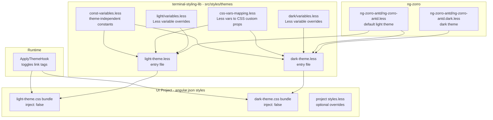

## Best Practices

1. Css-переменные должны начинаться с префикса "ats". Большая вероятность, что в будущих релизах ng-zorro темы будут настраиваться через css-переменные. Префикс нужен чтобы избежать конфликтов именования.

### Architecture Diagram

